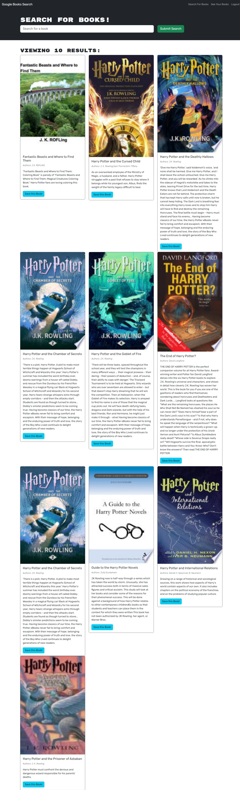
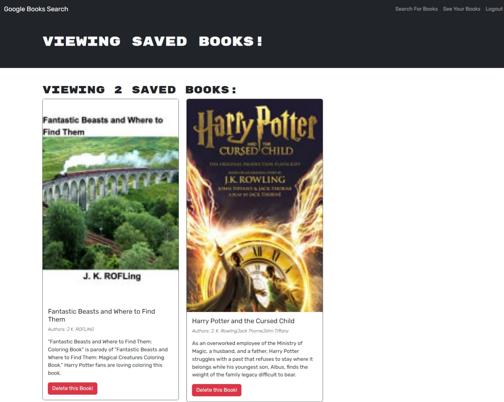
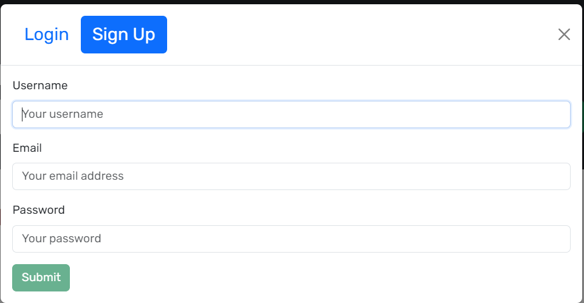
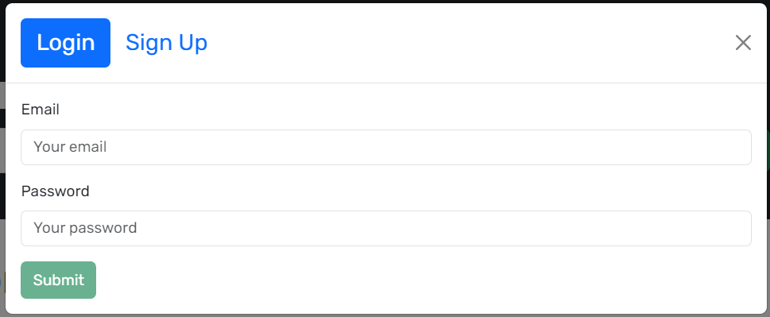

# Book-Search-Engine

## Description
    
A webpage for readers to search for books that they are interested in reading/buying and save them to a list under their individual login account.
    
## Table of Contents
    
- [Installation](#installation)
- [Usage](#usage)
- [Credits](#credits)
- [License](#license)
- [How to Contribute](#how-to-contribute)
- [Tests](#tests)
    
## Installation
    
Open url link https://book-search-engine-mern-kvf0.onrender.com/ in a browser such as Google Chrome, Firefox or Edge etc.

## Usage

Search page
 

Saved Books page

 

Sign up / Login modal

 
 
    
## Credits
NA

## License
 
This project is licensed under the MIT License - see the [LICENSE.md](license) file for details    
 
## How to Contribute
    
Feel free to contribute your ideas or bug fixes for this project by raising a new issue or new pull request.
    
## Tests
NA